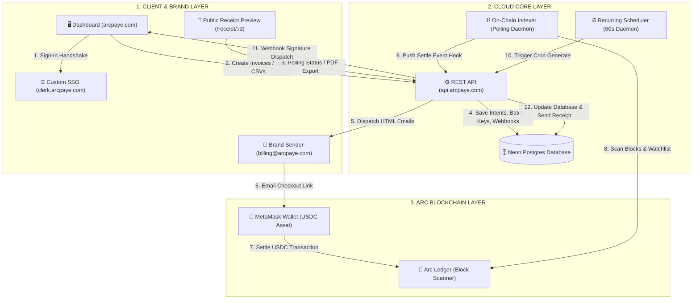

# 🏆 ArcPay Stablecoin Operating System: Complete Full-Stack Production Technical Documentation

Welcome to the definitive master technical manual for **ArcPay**—the premier, high-fidelity, gasless stablecoin payments and settlement operating system built for the **Arc Network** ecosystem. 

Every subsystem has been fully deployed, verified, and mapped under your custom brand domain **`arcpaye.com`** and is live globally in production.

This document compiles the complete production architecture, DNS mapping specifications, secure key matrices, modular directory file trees, and comprehensive engineering walkthroughs of every component we have built together, including the extended invoicing, receipts, settings tabs, API Key management, HMAC webhooks, scheduler, and multi-target SDK components.

---

## 🗺️ Live Production System Architecture

The following diagram illustrates the complete, real-time data flows, authentication handshakes, background workers, and on-chain telemetry of the live production platform:



---

## 🌐 1. Live Production URLs & Subsystems Directory

🚀 **All services are globally accessible and active under secure HTTPS SSL certificates:**

* 🖥️ **Merchant Console Dashboard:** **[https://arcpaye.com](https://arcpaye.com)** *(also handles `www.arcpaye.com`)*
* ⚙️ **Developer REST API Backend:** **[https://api.arcpaye.com](https://api.arcpaye.com)**
* 🔑 **Authentication Domain (Clerk):** **`clerk.arcpaye.com`**
* 📧 **Verified Brand Email Sender:** **`billing@arcpaye.com`**
* 📦 **GitHub Codebase Repository:** **[github.com/Aeyod7/arcpay](https://github.com/Aeyod7/arcpay)**

---

## 📋 2. Namecheap Advanced DNS Configuration

The custom domain **`arcpaye.com`** has been successfully mapped across your Vercel and Clerk projects. The following records are active in your **Namecheap DNS Advanced Panel**:

| Host | Record Type | Value / Target | Purpose |
| :--- | :--- | :--- | :--- |
| `@` | **A Record** | `76.76.21.21` | Directs apex `arcpaye.com` to the frontend dashboard |
| `www` | **CNAME Record** | `cname.vercel-dns.com.` | Directs `www.arcpaye.com` to the frontend dashboard |
| `api` | **CNAME Record** | `cname.vercel-dns.com.` | Directs `api.arcpaye.com` to the REST API backend |
| `clerk` | **CNAME Record** | `accounts.clerk.services.` | Directs custom auth handshakes to Clerk's secure servers |

> [!NOTE]
> All automated email MX/TXT authentication files (DKIM, SPF, and DMARC keys) have been fully verified on **Resend**, enabling authorized email delivery native to the `@arcpaye.com` brand.

---

## 🔑 3. Secure Production Keys Matrix

To protect your secrets, **zero API keys** are hardcoded in the codebase or committed to GitHub. All keys are injected directly as secure environment variables:

### 🖥️ Next.js Frontend Project (`apps/dashboard`)

| Variable Key | Scope | Purpose |
| :--- | :--- | :--- |
| `NEXT_PUBLIC_CLERK_PUBLISHABLE_KEY` | Production & Dev | Integrates merchant sign-in portal under your custom brand (`pk_live_Y2xlcmsuYXJjcGF5ZS5jb20k`) |
| `CLERK_SECRET_KEY` | Production & Dev | Handles private verification and token handshakes on-session (`sk_live_...`) |
| `NEXT_PUBLIC_API_URL` | Production | Points Next.js frontend calls to your custom backend domain `https://api.arcpaye.com` |

### ⚙️ Express REST API Project (`apps/api`)

| Variable Key | Scope | Purpose |
| :--- | :--- | :--- |
| `DATABASE_URL` | Production | Connects Serverless Functions to your Neon PostgreSQL cluster |
| `RESEND_API_KEY` | Production | Authenticates email dispatches via verified `billing@arcpaye.com` domain |

---

## 📂 4. Monorepo Project File Tree

```
arcpay/
├── vercel.json               # Route handler directing /api/* to Express serverless
├── tsconfig.json             # Root-level TypeScript configuration
├── package.json              # Monorepo workspaces definition and postinstall hooks
├── everything_we_have_built.md # THIS MANUAL
│
├── apps/
│   ├── dashboard/            # Next.js Merchant Portal & Public Receipt UI (Frontend)
│   │   ├── src/
│   │   │   └── app/
│   │   │       ├── globals.css          # Styling tokens
│   │   │       ├── layout.tsx           # Clerk layout wrapper & fallback engines
│   │   │       ├── page.tsx             # Premium Stitch Landing Page & simulators
│   │   │       ├── merchant_dashboard/  # Metrics, graphs, and transaction histories
│   │   │       ├── invoices/
│   │   │       │   ├── page.tsx         # Invoice list overview
│   │   │       │   ├── batch/page.tsx   # CSV batch upload page
│   │   │       │   ├── recurring/page.tsx # Recurring invoice schedule management
│   │   │       │   └── pay/[id]/page.tsx # Public pay screen
│   │   │       ├── payouts/             # Payouts settlements dashboard
│   │   │       ├── receipt/[invoiceId]/ # Public receipt render
│   │   │       │   ├── page.tsx         # Server wrapper (generateMetadata)
│   │   │       │   └── receipt-client.tsx # Client component with auto-polling & download
│   │   │       └── settings/            # Tabbed merchant preferences
│   │   │           ├── page.tsx         # General/legacy settings tab
│   │   │           ├── profile/page.tsx # Business profile configuration
│   │   │           ├── api-keys/page.tsx # SHA-256 API key management
│   │   │           └── webhooks/page.tsx # Webhooks URL and topic setup
│   │
│   └── api/                  # Express REST API & Database engine (Backend)
│       ├── server.mjs        # Main Express API, programmatic seeder, and core routes
│       ├── package.json
│       ├── lib/
│       │   └── invoiceHelpers.mjs # Shared logic (gen invoice#, Resend emails, pdfkit receipt)
│       ├── middleware/
│       │   ├── apiKeyAuth.mjs # API Key SHA-256 validation middleware
│       │   └── clerkAuth.mjs  # Clerk JWT parsing & dev fallback middleware
│       ├── routes/
│       │   ├── merchant.mjs   # Merchant profile routes
│       │   ├── invoices.mjs   # PDF receipt, batch creation, and recurring generator routes
│       │   ├── apikeys.mjs    # API key generation/revocation routes
│       │   ├── webhooks.mjs   # Webhooks configuration & HMAC signature dispatcher
│       │   └── v1/
│       │       └── invoices.mjs # Public REST API (protected by apiKeyAuth)
│       └── prisma/
│           ├── schema.prisma # Neon Serverless PG connection & models schema
│           └── seed.mjs      # Database manual seeder scripts
│
├── packages/
│   └── sdk/                  # Multi-target SDK client
│       ├── src/index.ts      # TypeScript core (ArcPayClient classes & signature verify)
│       └── package.json
│
└── services/
    ├── indexer/              # Background Arc Blockchain scanning daemon
    │   ├── index.js          # Pending transaction blockchain poll-to-settle loop
    │   └── package.json
    └── scheduler/            # Background schedule invoicing cron
        ├── index.js          # Recurring generator webhook poller
        └── package.json
```

---

## 📦 5. Comprehensive Subsystems Walkthrough

### A. Next.js Merchant Console Frontend (`apps/dashboard`)

1. **Stitch Premium Landing Page (`apps/dashboard/src/app/page.tsx`):**
   * A premium, light-themed landing page styled based on **Stitch Design System** aesthetics, complete with curated HSL color systems, subtle micro-animations, transparent pricing blocks, and merchant metrics.
   * **Developer Documentation Hub:** An interactive code toggle interface showcasing cURL integration blocks, TypeScript SDK snippets, and raw Webhook JSON payloads.
   * **MetaMask Checkout Simulator:** An inline Web3-like interactive widget that simulates payment requests, wallet connections, transaction signatures, and cryptographic settlement confirmations.
2. **Public Receipt Page (`apps/dashboard/src/app/receipt/[invoiceId]/`):**
   * **`page.tsx` (Server wrapper):** Injects dynamic `generateMetadata` tags at request-time. Generates beautiful Rich Link previews on social platforms (displaying invoice numbers, amounts, client names, and statuses).
   * **`receipt-client.tsx`:** An unauthenticated public screen with high-fidelity status badges. It auto-polls every 5 seconds for pending transfers, copies clipboard URLs, and links directly to on-chain blockchain explorer transactions and Express-generated PDF receipts.
3. **CSV Batch Upload UI (`apps/dashboard/src/app/invoices/batch/page.tsx`):**
   * Drag-and-drop CSV drop zone with inline syntax checks. It parses inputs locally (email, wallet, description, amount) and displays parsed columns with totals for verification before bulk-triggering.
4. **Tabbed settings panels (`apps/dashboard/src/app/settings/`):**
   * Integrates a unified, four-part tabbed navigation selector:
     * **Profile Settings (`profile/page.tsx`):** Manage business profile parameters (tax IDs, websites, physical addresses, logos, and business names) shown on bills.
     * **API Keys Panel (`api-keys/page.tsx`):** Generate new live developer keys. Displays the raw private token `apk_live_...` only once upon creation, hashing it on-db, and listing active statuses and last used timestamps.
     * **Webhooks Panel (`webhooks/page.tsx`):** Registers listener endpoints, checks event selectors (`invoice.created`, `invoice.paid`, etc.), and exposes HMAC verification secrets.
     * **General Credentials (`page.tsx`):** Handles legacy webhooks and merchant contact details for backward compatibility.

### B. Express REST API Backend (`apps/api`)

1. **Serverless PACK Architecture (`vercel.json`):**
   * The root `vercel.json` maps all Express router modules seamlessly to run under Vercel Serverless Functions under the `/api/(.*)` pattern using `@vercel/node`.
2. **Modular Route Handlers (`apps/api/routes/`):**
   * **`merchant.mjs`:** Exposes `GET/PUT /api/merchant/profile` endpoints to manage merchant metadata.
   * **`invoices.mjs`:** Contains `/batch` invoice creators, `/receipt.pdf` file streams, and `/recurring/generate` manual dispatchers.
   * **`apikeys.mjs`:** Generates secure live API tokens, registers key prefixes, and handles revocation.
   * **`webhooks.mjs`:** Manages subscriptions and includes the shared HMAC-SHA256 signer webhook delivery mechanism.
   * **`v1/invoices.mjs`:** The public developer API supporting authenticated `POST /api/v1/invoices`, `GET /invoices`, `PUT`, `DELETE` (cancels unpaid bills), and batch processors.
3. **Authentication & Identity Middlewares:**
   * **`apiKeyAuth.mjs`:** Hashes headers using SHA-256 (`x-arcpay-api-key`), queries the database for matches, updates `lastUsedAt` fields, and attaches `req.merchantId` to requests.
   * **`clerkAuth.mjs`:** Parses Clerk Session JWTs via JWKS keys. Features fallback mechanisms to `'default_merchant'` in dev modes when environment keys are absent.
4. **Shared Invoicing Library (`apps/api/lib/invoiceHelpers.mjs`):**
   * Exposes standard invoice helpers used by both internal routes and the v1 public endpoints:
     * `generateInvoiceNumber()`: Yields custom sequences (`INV-YYYY-XXXX`).
     * `sendInvoiceEmail()`: Dispatches HTML payment requests via Resend.
     * `generateInvoicePdf()`: Stream pipes dynamic `pdfkit` files (featuring company headers, status-colored banners, line items, and on-chain proof metadata).

### C. Background Daemon Services

1. **On-Chain Blockchain Indexer (`services/indexer/index.js`):**
   * Continually polls the REST API for `pending` invoices, monitors the Arc Network blockchain transactions for matching destination wallets and transfer values, and auto-settles status updates back to the API.
2. **Recurring Invoice Scheduler (`services/scheduler/index.js`):**
   * A polling timer service that hits `/api/invoices/recurring/generate` every 60 seconds. Checks active templates, generates pending invoices when their due dates are reached, and advances the next scheduled dates.

### D. TypeScript SDK Client (`packages/sdk/src/index.ts`)
* A multi-target NPM-ready SDK package containing the `ArcPayClient` class for:
  * Invoice lifecycle controls (`createInvoice`, `getInvoice`, `listInvoices`, `updateInvoice`, `cancelInvoice`).
  * Bulk invoicing (`createBatch`).
  * Webhook listener management (`createWebhook`, `listWebhooks`, `deleteWebhook`).
  * Helper utilities (`verifyWebhookSignature` via HMAC Node-crypto/WebCrypto fallbacks and `verifyOnChainSettlement` via ethers).

---

## 🚀 6. Local Development & Operational Guide

### 💻 Running the Full-Stack Platform Locally

To spin up all workspaces concurrently in your local development environment:

1. **Install Workspaces Dependencies:**
   ```bash
   npm install
   ```
2. **Compile Prisma Client Binaries:**
   ```bash
   npm run postinstall
   ```
3. **Launch All Subsystems Concurrently (parallel dev script):**
   ```bash
   npm run dev
   ```
   * 🖥️ **Merchant Frontend:** Active locally on **`http://localhost:3000`**
   * ⚙️ **Express REST API:** Active locally on **`http://localhost:62650`**
   * ⏰ **Invoice Scheduler Daemon:** Checks active schedules every 60 seconds.

---

> [!NOTE]
> This master documentation has been written to the project's root folder (`C:/Users/aeyon/.gemini/antigravity/scratch/arcpay/everything_we_have_built.md`) and registered inside your local git repository.
